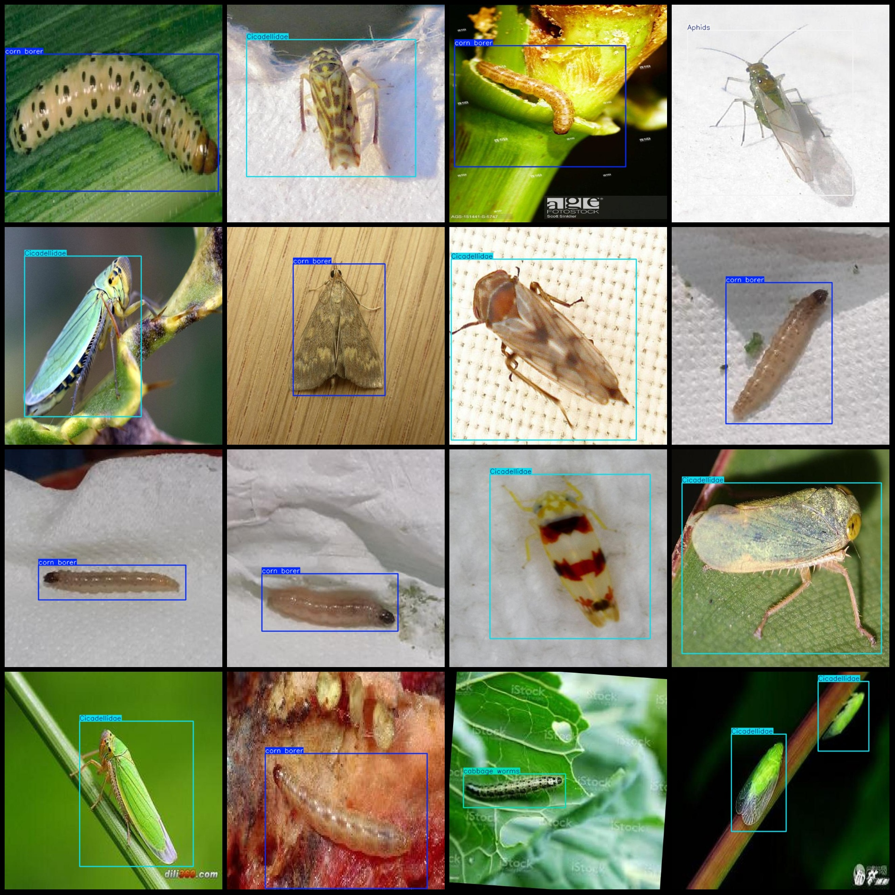

# Agricultural Field Insect Detection Dataset VOC+YOLO format - 2968 images in 16 categories

Dataset format: Pascal VOC format + YOLO format (txt file without split path, only including jpg images and corresponding VOC format xml files and YOLO format txt files)
Number of images (jpg file count): 2968
Number of annotations (xml file count): 2968
Number of annotations (txt file count): 2968
Number of annotation categories: 16
Annotation category names (note that the order of categories in the YOLO format does not correspond to this, but is based on the classes.txt in the labels folder): ["Aphids", "Cicadellidae", "Citrus Leaf Miner", "Snout Moths", "Stem Borer", "Thrips", "Whiteflies", "army worm", "cabbage worms", "corn borer", "cutworm"]
"earworm","grub","oides decempunctata","peach borer","red spider"]  
boxes per class:   
Aphids (Aphid Box Count = 737)
Cicadellidae (Lepidoptera Family Cicadellae, Aphid Box Count = 771)
Citrus Leaf Miner (Butterfly family Pieridae, Aphid Box Count = 5)
Snout Moths (Moth family Lepidoptera, Aphid Box Count = 1)
Stem Borer (Coleoptera family Curculionidae, Aphid Box Count = 2)
Thrips (Hymenoptera family Thysanoptera, Aphid Box Count = 1)
Whiteflies (Hemiptera family Aleyrodidae, Aphid Box Count = 6)
army worm (Heliodiplidae family Heliodiplidae, Aphid Box Count = 220)
cabbage worms (Lepidoptera family Noctuidae, Aphid Box Count = 491)
corn borer (Noctuidae family Silhouetteidae, Aphid Box Count = 605)
cutworm (Lepidoptera family Pyralidae, Aphid Box Count = 285)
earworm (Lepidoptera family Tortricidae, Aphid Box Count = 204)
grub (Coleoptera family Scarabaeidae, Aphid Box Count = 279)
oides decempunctata (Coleoptera family Tenebrionidae, Aphid Box Count = 84)
peach borer (Lepidoptera family Pyraustidae, Aphid Box Count = 132)
Red spider (red spider) box count = 91
total boxes: 3914  
image resolution: 640x640  
Use annotation tool: labelImg
Annotation rule: draw a rectangle around the class
Important notes: None
Special statement: This dataset does not guarantee the accuracy of the trained models or weight files.
Image preview:
## Images

Here is a pay link on Stripe ( https://buy.stripe.com/3cs8yP7sY87d0vu9AB ). Please contact me lonlonago@foxmail.com after funding $89, and I will send you a complete data files , thank you!

